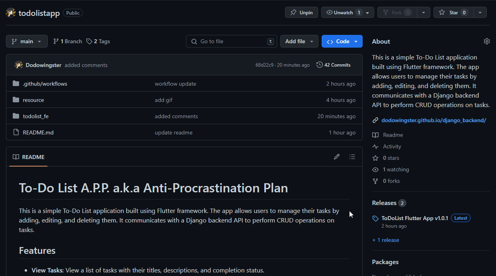

# To-Do List A.P.P. a.k.a Anti-Procrastination Plan

This is a simple To-Do List application built using Flutter framework. The app allows users to manage their tasks by adding, editing, and deleting them. It communicates with a Django backend API to perform CRUD operations on tasks.

## :star2:Features

- **View Tasks**: View a list of tasks with their titles, descriptions, and completion status.
- **Add Task**: Add new tasks with titles and descriptions.
- **Edit Task**: Modify existing tasks including updating title, description, and completion status.
- **Delete Task**: Remove tasks from the list.
- **Anti-Procrastination Plan (A.P.P.)**: Encourages users to stay productive by managing their tasks effectively.

## :wrench:Instructions

1. Download the release of this githup project and extract it somewhere.  
   Note: you may need to use [7zip](https://www.7-zip.org/) or [WinRAR](https://www.win-rar.com/start.html?&L=0) to extract the contents

   

2. Make sure django backend server is up and running. More instructions on that here: https://dodowingster.github.io/django_backend/

   

3. Run the todolist_fe.exe

   

## Dependencies

- **flutter/material.dart**: UI components for building the app.
- **intl**: Internationalization support for formatting dates.
- **[http](https://pub.dev/packages/http)**: Used for making HTTP requests.

## Usage

- Upon launching the app, you'll see a list of existing tasks (if any).
- Tap the "+" button to add a new task. Fill in the title and description, then tap "Add" to save.
- Long press on a task to bring up options for editing or deleting it.
- To edit a task, tap on "Edit" from the options, make necessary changes, and tap "Save".
- To delete a task, tap on "Delete" from the options.

## Screenshots

