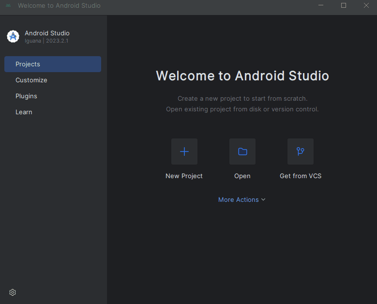
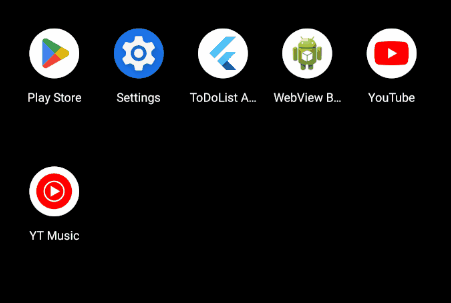

# To-Do List A.P.P. a.k.a Anti-Procrastination Plan

This is a simple To-Do List application built using Flutter framework. The app allows users to manage their tasks by adding, editing, and deleting them. It communicates with a Django backend API to perform CRUD operations on tasks.

## :star2:Features

- **View Tasks**: View a list of tasks with their titles, descriptions, and completion status.
- **Add Task**: Add new tasks with titles and descriptions.
- **Edit Task**: Modify existing tasks including updating title, description, and completion status.
- **Delete Task**: Remove tasks from the list.
- **Anti-Procrastination Plan (A.P.P.)**: Encourages users to stay productive by managing their tasks effectively.

## :tada:Pre-requisites

- [**Flutter SDK**](https://docs.flutter.dev/get-started/install)
  
   To run Flutter command lines in your terminal. Follow the Flutter installation documentation and pick your OS and then for Android. Proceed with the installation document.

- [**Android Studio**](https://developer.android.com/studio)
   
   Android SDKs and Android Emulator to test the app and connect it to a running localhost server. Follow Android Studio installation method from the Flutter documentation.
   Once you have them installed, launch Android Studio, Select SDK Manager and make sure all these boxes are ticked. Click Apply afterwards.

   <details>
   <summary>Preview SDK Manager Setup</summary>

   

   </details>

## :wrench:Instructions

1. Clone this Repository

   ```
   git clone https://github.com/Dodowingster/todolistapp.git
   ```

2. Navigate into the todolist app directory

   ```
   cd todolist_fe
   ```

1. Install Dependencies using:

   ```
   flutter pub get
   ```

2. Build the apk with this command line:

   ```
   flutter build apk
   ```

3. Start Android Emulator Virtual Device. This mobile app was tested on Pixel 8 Pro, but you may try on other devices whichever you prefer. Make sure to have the Virtual Device
   Depencies installed.

   <details>
   <summary>Preview Android Virtual Device</summary>
   
   

   </details>

3. Install the apk into your virtual device

   ```
   flutter install
   ```

2. Make sure django backend server is up and running. More instructions on that here: https://dodowingster.github.io/django_backend/

   <details>
   <summary>Preview 'docker compose up' in Terminal</summary>

   

   </details>

3. Launch the App

   <details>
   <summary>Preview Launch TodoList A.P.P.</summary>

   

   </details>

## :pushpin:Dependencies

- **flutter/material.dart**: UI components for building the app.
- **intl**: Internationalization support for formatting dates.
- **[http](https://pub.dev/packages/http)**: Used for making HTTP requests.

## :white_check_mark:Usage

- Upon launching the app, you'll see a list of existing tasks (if any).
- Tap the "+" button to add a new task. Fill in the title and description, then tap "Add" to save.
- Long press on a task to bring up options for editing or deleting it.
- To edit a task, tap on "Edit" from the options, make necessary changes, and tap "Save".
- To delete a task, tap on "Delete" from the options.

## Screenshots


